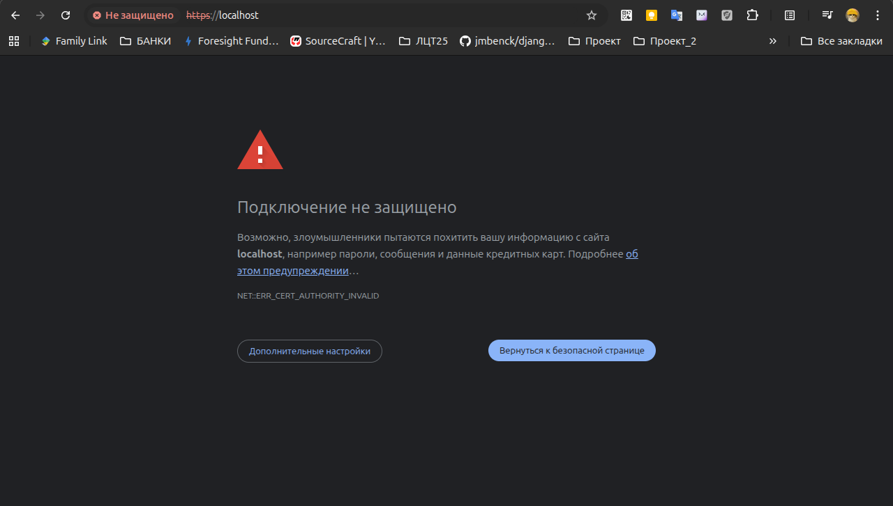
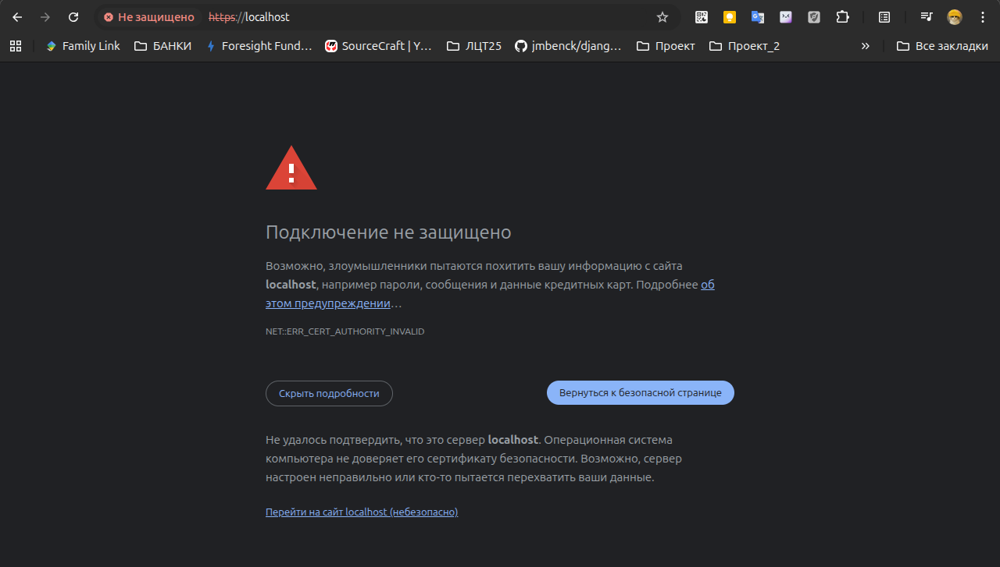
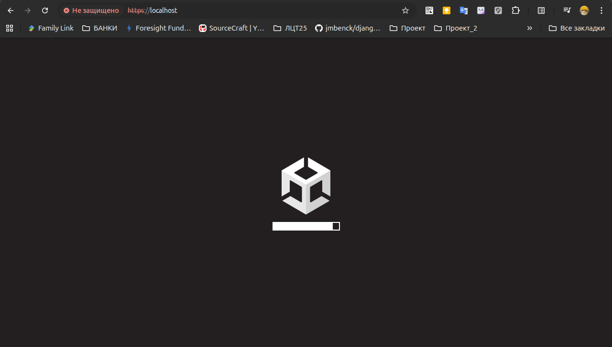

# Проект "Nerpa Games"

## Проект уже доступен для просмотра в браузере по адресу сервера https://89.111.169.123. 
## <span style="color: red;">**!ВНИМАНИЕ!**</span> Так как игра находится в режиме разработки рекомендуется заходить в приложение, используя для подключения к Интернет мобильную сеть.

## <span style="color: red;">**!ВНИМАНИЕ!**</span> При первом заходе браузер выдаст предупреждение о небезопасности, так как используется сертификат шифрования SSL, который не подписан доверенным центром сертификации. Это нормальное поведение для самоподписанных сертификатов и в последствии его нужно будет заменить на оффициальный.



Вы можете нажать "Дополнительные настройки" 



и "Перейти на сайт...", чтобы увидеть игровое приложение.



---

## Разворачиваем проект на сервере через Docker и docker-compose.yml:
1. Создать папку и перейти в нее 
```bash
mkdir game && cd game 
```
2. Клонируем репозитлорий
```bash
git clone https://github.com/Inna949Festchuk/Game_ldt_25.git
```
3. Переходим в папку проекта
```bash
cd Game_ldt_25
```
4. Собираем образ
```bash
docker-compose build --no-cache
```
5. Запускаем сервис
```bash
docker-compose up -d
```
6. Переходим в браузере `http://IP-адрес вашего сервера/`
   
7. Выгружаем сервис с удалением томов
```bash
docker-compose down -v
```
---
**Обновление игры**

8. Удаляем папку staticfiles (чтобы игра коректно обновлялась при появлении новых материалов)
```bash
rm -rf staticfiles
```
9. Для обновления проекта из папки Game_ldt_25 запускаем 
```bash
git pull
```
---
10.  Удаляем !ВСЕ! старые контейнеры если что-то пошло совсем не так:
```bash
docker system prune -a --volumes --force
```

---

## Для доработки проекта запускаем проект локально в виртуальном окружении (Linux Ubuntu 24.04 LTS):

1. Создать папку и перейти в нее 
```bash 
mkdir game && cd game
```
2. Клонируем репозиторий
```bash
git clone https://github.com/Inna949Festchuk/Game_ldt_25.git
```
3. Создаем виртуальное окружение
```bash 
python -m venv venv
```
4. Активируем виртуальное окружение
```bash 
source venv/bin/activate
```
5. Устанавливаем необходимые зависимости
```bash 
python -m pip install -r requirements.txt
```
6. Запускаем сервер разработки (для доработки проекта)
```bash 
python manage.py runserver 0.0.0.0:8000
```
7. Останавливаем сервер `"Ctrl+C"`


## Копирование больших файлов (более 100 Мб на файл и более 1Гб на общий объем проекта) игры в .zip архиве через Google Drive на боевой сервер:
1. Загрузить на Google Drive и открыть общий доступ по ссылке к файлу `webgl.zip`
2. Открываем в браузере `https://drive.google.com/file/d/1bHoFrBRcjGANxRCedSol7co3KPnTCnDv/view?usp=share_link` и копируем id файла `1bHoFrBRcjGANxRCedSol7co3KPnTCnDv`
3. На сервере создаем папку `data`
```bash 
mkdir data && cd data
```
4. Создаем переменные окружения
```bash
export FILE_ID="1bHoFrBRcjGANxRCedSol7co3KPnTCnDv"
export FILE_NAME="webgl.zip"
```
5. Загружаем файл `
```bash 
wget --load-cookies /tmp/cookies.txt "https://docs.google.com/uc?export=download&confirm=$(wget --quiet --save-cookies /tmp/cookies.txt --keep-session-cookies --no-check-certificate "https://docs.google.com/uc?export=download&id=${FILE_ID}" -O- | sed -rn 's/.*confirm=([0-9A-Za-z_]+).*/\1\n/p')&id=${FILE_ID}" -O ${FILE_NAME} && rm -rf /tmp/cookies.txt
```
6. Копируем архив в папку `/root/nerpa/Game_ldt_25/staticfiles`
```bash
cp data/${FILE_NAME} /root/nerpa/Game_ldt_25/staticfiles
```
7. Распаковываем архив (`sudo apt update && sudo apt install unzip`)
```bash
unzip ${FILE_NAME}
```
8. Удаляем архив
```bash
rm -rf ${FILE_NAME}
```

---

## Процедура создания самоподписанных SSL-сертификатов

Эти шаги нужно выполнить на вашем хост-компьютере (не внутри контейнера).

1.  **Создайте директорию для сертификатов.**
    В корне вашего проекта выполните команду. Эта структура (`nginx/ssl`) соответствует пути, указанному в `docker-compose.yml`.

```bash
mkdir -p nginx/ssl
```

2.  **Сгенерируйте сертификат и ключ.**
    Выполните следующую команду `openssl` в терминале. Она создаст два файла (`nginx-selfsigned.crt` и `nginx-selfsigned.key`) в директории `nginx/ssl/`.

```bash
openssl req -x509 -nodes -days 365 -newkey rsa:2048 \
-keyout nginx/ssl/nginx-selfsigned.key \
-out nginx/ssl/nginx-selfsigned.crt
```

В процессе вам будет предложено ввести информацию для сертификата (страна, город и т.д.). Для самоподписанного сертификата эти поля можно заполнить произвольно или оставить пустыми. Самое важное поле — **Common Name (e.g. server FQDN or YOUR name)**. Введите сюда ваш IP-адрес (`89.111.169.123`) или доменное имя (`your_domain.com`).

### Порядок запуска

После того как вы внесли все изменения и создали сертификаты, вы можете запустить проект:

1.  **Пересоберите образы**, чтобы применить изменения в `Dockerfile` и **Запустите контейнеры** в фоновом режиме:

```bash
docker-compose up -d --build
```

Теперь ваш сайт должен быть доступен по адресу https://89.111.169.123. 

**!ВНИМАНИЕ!** При первом заходе браузер выдаст предупреждение о небезопасности, так как используется сертификат шифрования SSL, который не подписан доверенным центром сертификации. Это нормальное поведение для самоподписанных сертификатов.


Вы можете нажать "Дополнительные настройки" 


и "Перейти на сайт...", чтобы увидеть игровое приложение.

